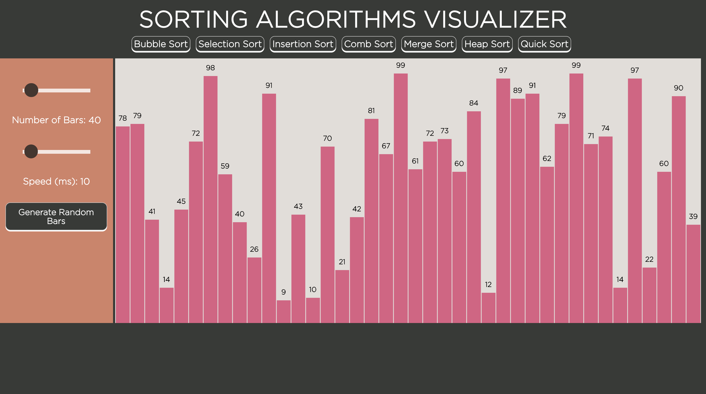

# Sorting Algorithms Visualizer

This visualization tool implements 7 different sorting algorithms, and made using only vanilla Javascript, HTML5, & CSS3. The interactive sorting visualizer can be found at https://brandonktran.github.io/Sorting_Algorithms_Visualizer/. I was inspired to do this project because of Apal Shah's bubble sort visualizer. Still working out some bugs and styling choices.

 
