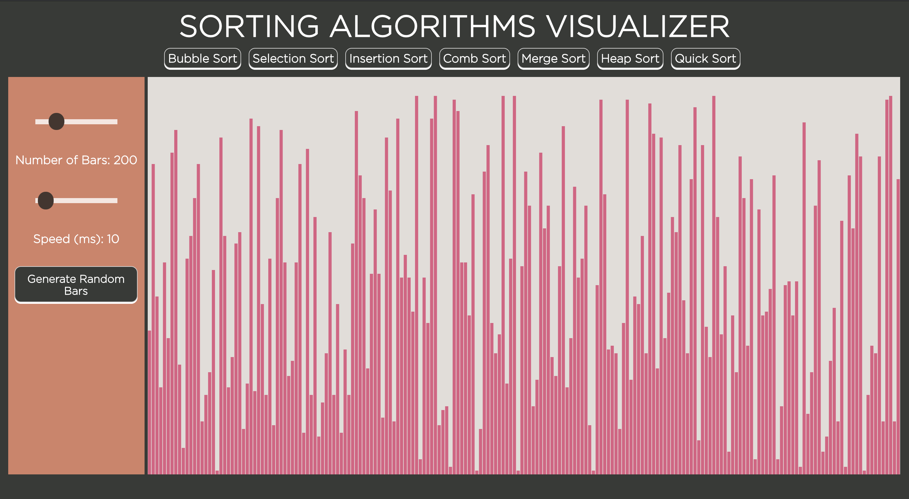
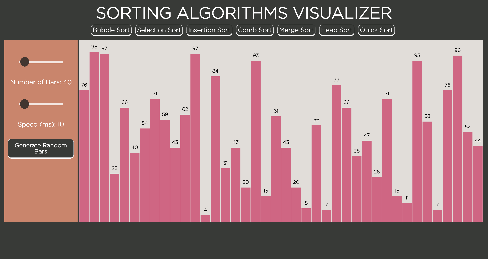
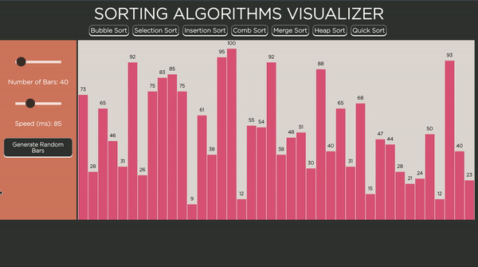
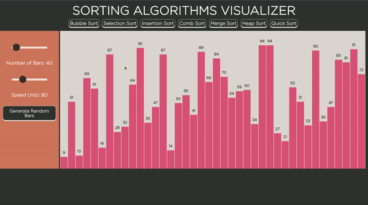

# Sorting Algorithms Visualizer

This visualization tool implements 7 different sorting algorithms, and made using only vanilla JavaScript, HTML5, & CSS3. The interactive sorting visualizer can be found at https://brandonktran.github.io/Sorting_Algorithms_Visualizer/ (Open in Chrome). This project was inspired by Apal Shah's bubble sort visualization. 

 
